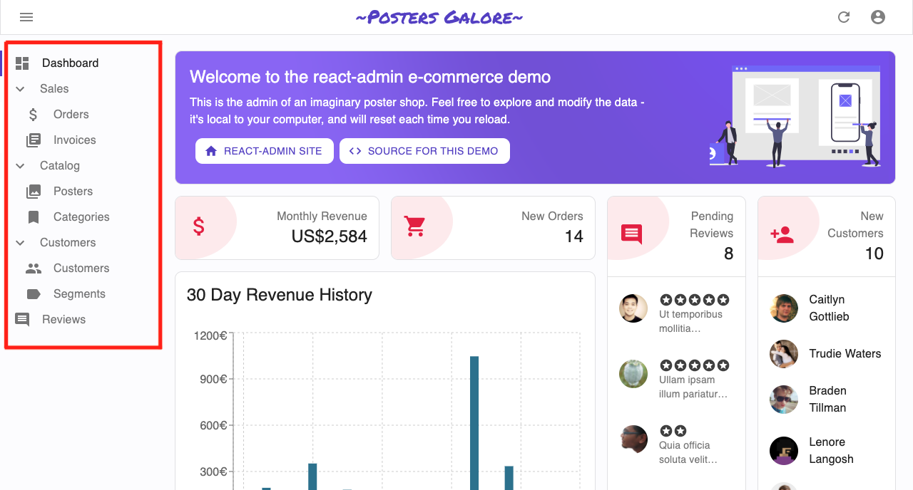
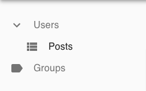

# ra-treemenu

*A tree-like menu implementation for react-admin.*

Inspired from the official react-admin [demo application](https://marmelab.com/react-admin-demo/#/), this package facilitates quick and easy integration of the menu tree in any new or existing react-admin app.


**Supported react-admin versions:**

* React-Admin 3.x




# Installation

Install using npm:

`npm install --save @bb-tech/ra-treemenu`

# Basic Usage

To use `ra-treemenu` in your react-admin application:

1. Create a parent resource (non-routing) with the following key in the options prop: `isMenuParent = true`. Remember to pass the mandatory `name` prop in this resource as this will be used to map the child resource to it's specified parent in the tree.

```js
<Resource name="users" options={{ "label": "Users", "isMenuParent": true }} />
```

2. Now create a child resource under this parent by mapping the `menuParent` option in the `options` props to the `name` of your parent resource.

```js
<Resource name="posts" options={{ "label": "Posts", "menuParent": "users" }} />
```

This should give you a menu structure like below:



# Examples


Here's a simple example of organising the menu into a tree-like structure:

```js
// In App.js
import * as React from 'react';
import { Admin, Resource, Layout } from 'react-admin';
/* Import TreeMenu from the package */
import TreeMenu from '@bb-tech/ra-treemenu';

const App = () => (
    <Admin layout={(props) => <Layout {...props} menu={TreeMenu} />} >
        {/* Dummy parent resource with isMenuParent options as true */}
        <Resource name="users" options={{ "label": "Users", "isMenuParent": true }} />
        {/* Children menu items under parent */}
        <Resource name="posts" options={{ "label": "Posts", "menuParent": "users" }} />
        <Resource name="comments" options={{ "label": "Comments", "menuParent": "users" }} />
        {/* Dummy parent resource with isMenuParent options as true */}
        <Resource name="groups" options={{ "label": "Groups", "isMenuParent": true }} />
        {/* Children menu items under parent */}
        <Resource name="members" options={{ "label": "Members", "menuParent": "groups" }} />
    </Admin>
);

export default App;
```

You can find an example application implementing this tree menu in the `examples` directory.


# Advanced Recipes

### Using a Custom Layout

It is completely possible to use `ra-treemenu` inside your custom app layout.

```js
// In App.js
/* Import CustomLayout */
import CustomLayout from './CustomLayout';
 
const App = () => (
    <Admin layout={CustomLayout}>
        ...
    </Admin>
);

export default App;
```

```js
// In CustomLayout.js
/* Import TreeMenu from the package */
import TreeMenu from '@bb-tech/ra-treemenu';
 
const CustomLayout = (props) => (
    <Layout {...props} menu={TreeMenu} />
);

export default CustomLayout;
```

### Using Custom Icons for Resources

For icons, `ra-treemenu` depends upon [material-ui](https://material-ui.com/components/material-icons/) and the defaults for the resources are:
1. `ViewListIcon`: For all child resources.
2. `Label`: For all parent resources (non-routing).

To use a custom icon (for a parent or a child), pass it as a prop to the `<Resource>` like:

```js
<Resource name="posts" icon={CustomIcon} options={{ "label": "Posts", "menuParent": "users" }} />
```